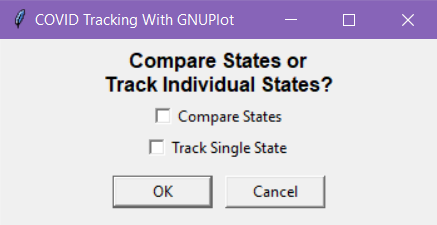
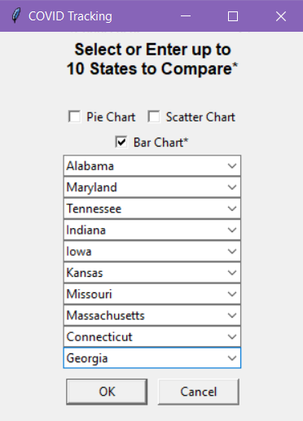
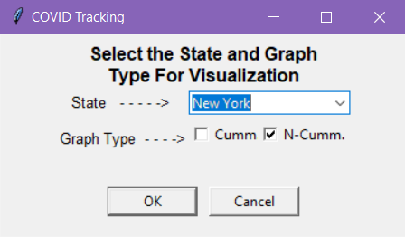
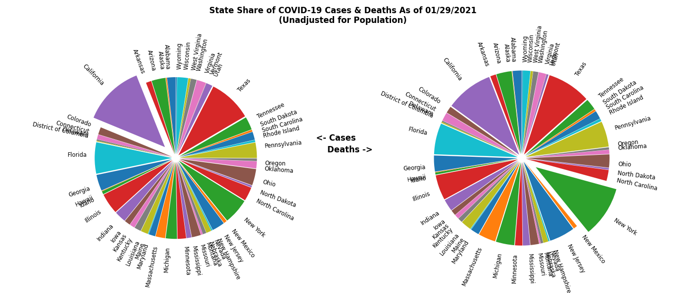

# COVID-19-Tracking

In short, this is a python script that grabs the current COVID-19 data from various GitHub repos which track the numbers. From there I use the pandas python library to parse the data in the CSV file to be used in a manner that the user decides (i.e. compare states, cumulative vs noncumulative). I then prompted the user to show a depiction of daily increases in COVID-19 death, hospitalizations, and infections.

Be sure to have gnuplot installed on your system:

## Windows
Download the latest version of the installer from gnuplot [site](https://sourceforge.net/projects/gnuplot/files/gnuplot/).

Run the downloaded file and allow it to run as administrator if requested

On the setup window select the language and follow the instructions on screen.

(optional) During the installation you may select the gnuplot to be added to the PATH that will allow you to run commands from anywhere on the command line. If you choose not to do so you may add it manually later or cd to the gnuplot installed directory prior to running commands.

The default installation location of gnuplot on Windows is C:\Program Files (x86)\gnuplot

NOTE: the filename will be of the format: gp\<version\>-win32-mingw.exe

## Linux
The installation on Linux can be done through the different package managers as follows.

## Arch
`$ sudo pacman -S gnuplot`

## Debian and Ubuntu
`$ sudo apt-get update`
`$ sudo apt-get install gnuplot`

## CentOS / RedHat
`$ sudo yum check-update`
`$ sudo yum install gnuplot`

## Fedora
`$ sudo dnf check-update`
`$ sudo dns install gnuplot`

## Mac OSX
Using Homebrew
`$ brew install gnuplot`
Using MacPorts
`$ sudo port install gnuplot`

Run this command to install dependencies:
`pip3 install -r requirements.txt`

Navigate to the `src` folder and run the main file with:
`python3 main.py`

## Screenshots

 

## Repos Used:

NYC Coronavirus Disease 2019 (COVID-19) Data
https://github.com/nychealth/coronavirus-data

Coronavirus (Covid-19) Data in the United States
https://github.com/nytimes/covid-19-data/
